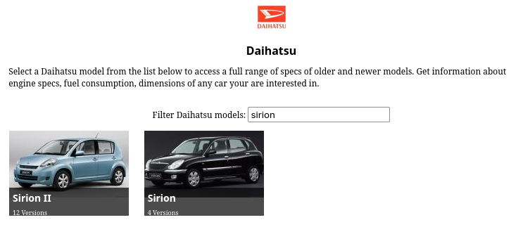

+++
date = '2025-08-15T20:48:27+02:00'
draft = true
title = 'Car inspection: Daihatsu Sirion 2006 '
summary = "Since i have been working in the automotive industry for almost 2 years now, i think it's kind of time to get into cars. My very first project will be a FULL checkup of a Daihatsu Sirion 2006. From the internals to the externals and there will be soooooo much to learn. Lets dive in."
+++

## Preliminary knowledge

In this chapter i'll be talking about my knowledge state and what i did to ramp up.

### My current skill set

The skill set goes as far:
- Drivers license achieved 2 years ago, but haven't driven since (just picked up driving again)
- Knowledge about steering system due to my job
- Okay physics
- Shit ton of motivation for learning/ understanding new things and researching.
  
Hardest part will be to identify not obvious deviations that happen during driving, since i have almost no expertise in feeling out the car, hear things etc.

## Theoretical ramp-up

Multiple videos were digested in a couple of days (see [#References](#references)) to get a basic understanding of the internal workings of the car. I think i get the general idea now.

### Key technical parameters of a car

TODO write about the parameters of the car which can be used to determine the "goodness".

### Car specific stuff

The only thing i know about the car is that its a Daihatsu Sirion 2006. When i first tried to google these exact phrase couldn't really find the proper model because of the lot of results.

I tried to search for something like a database that has information on car models so somehow i could identify the car and its internal parts.

Found a site called [ultimateSPECS](https://www.ultimatespecs.com/) which was recommended on multiple forums. It even seemed alright, had a category for Daihatsu and also the specific model, however i could not match the tested car to any of the ones on the site. There where even 2 models:

In the normal variant no 2006 model listed, however in the Sirion II there is one from the year 2006.

It looks good however, i feel like a more accurate and authentic source is needed. After more thinking...

### Gathering more stuff

More information was needed to accurately identify the parts of the car. I knew about VIN ( Vehicle Identification Number) which is a unique id for every car. Based on this, things could be looked up. Lot of shitty ass paid databases, i checked some of them with the cars VIN, however didn't really find a hit.

One other thing you can do in my country (and probably in others) to lookup a cars detailed information based on the name plate. So I did that.

Information gathered:

| **Category**           | **Field**                          | **Value**                                |
|------------------------|------------------------------------|------------------------------------------|
| **Vehicle Data**       | Manufacturer                       | Daihatsu                                 |
|                        | Model Code                         | M3                                       |
|                        | Commercial Description             | Sirion                                   |
|                        | Vehicle Category                   | M1 – Passenger car                       |
|                        | Vehicle Type                       | Passenger car                            |
|                        | Year of Manufacture                | 2006                                     |
|                        | EU Type Approval Number            | e13*2003/97*0147*00                      |
| **Engine Data**        | Engine Number/Code                 | 1KR0179895                               |
|                        | Engine Code                        | 1KR                                      |
|                        | Engine displacement                    | 998 cm³                                  |
|                        | Power Output                       | 51 kW                                    |
|                        | Operating Mode                     | Otto                                     |
|                        | Fuel Type                          | Unleaded petrol                          |
|                        | Environmental Classification       | 09                                       |
|                        | Gearbox                            | Manual (5-speed)                         |
| **Other Technical Data** | Vehicle Body Style               | Hatchback sedan                          |
|                        | Combined Weight                    | 1,390 kg                                 |
|                        | Curb Weight                        | 928 kg                                   |
|                        | Maximum Permissible Gross Weight   | 2,140 kg                                 |
|                        | Passenger Capacity                 | 5                                        |
|                        | Number of Seats (including driver) | 5                                        |
|                        | All-Wheel Drive                    | No                                       |
|                        | Number of Axles                    | 2                                        |
|                        | Number of Driven Axles             | 1                                        |

Got the engine number, thats awesome, also the actual model M3. Remember the engine displacement from the [ultimateSPECS](https://www.ultimatespecs.com/) site? The engine displacement differs so that information is considered invalid for us. Good thinking we kept looking.

## Testing of the car

The car will be inspected from 3 main perspective, trying to identify as many deviation as possible:
- Test drive
- Engine bay
- Interior and exterior

Unfortunately because of the lack of tools i cannot view the car from the bottom.

### Preparation

We identified the model of the car and 

## References

### Ramp-up, general car stuff:
- [ How a Car Engine Works ](https://www.youtube.com/watch?v=ZQvfHyfgBtA)
- [ TORQUE vs HORSEPOWER Explained In Less Than 3 Minutes](https://www.youtube.com/watch?v=a3LYCsG02IM)
- [BRAKES: How They Work | Science Garage](https://www.youtube.com/watch?v=6H7nwlT_qNY)
- [ Animation on How Power Brakes Work ](https://www.youtube.com/watch?v=LY_0REE-g0c)
- [ How do hydraulic brakes in cars and light vehicles work 3D animation ](https://www.youtube.com/watch?v=82qBBJ8iwcc)
- [ Understanding your Car's Steering & Power Steering ! ](https://www.youtube.com/watch?v=em1O8mz7sF0)
- [ How To Properly Inspect a Used Car So You Wouldn't Buy a Lemon](https://www.youtube.com/watch?v=PAxh4gqwHbY&t=2554s)

### About the Daihatsu Sirion 2006
- [ Cara Buka Cover Head unit Sirion Old ](https://www.youtube.com/watch?v=BAIDmIEkS4o)
